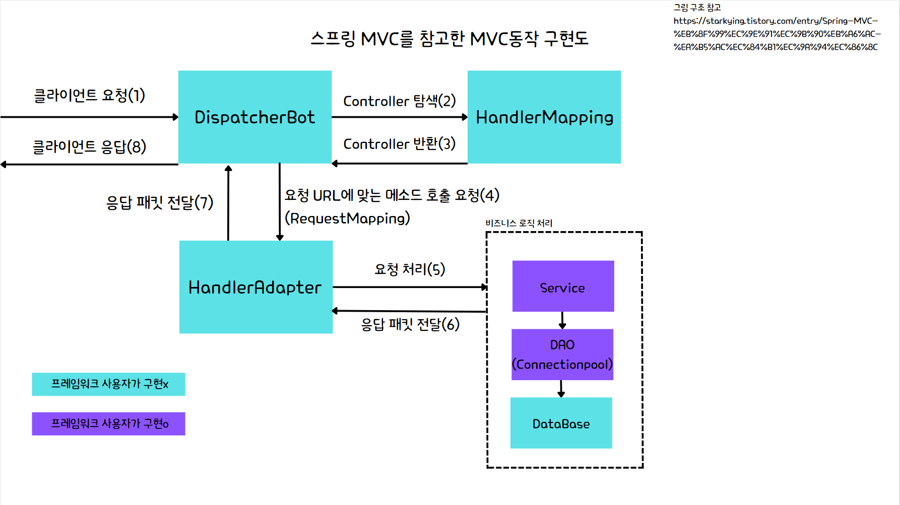

# Async Socket Server similar to Spring Project
- Java의 NIO(AsynchronousServerSocketChannel)를 이용한 멀티 쓰레드 비동기 소켓 서버 라이브러리 및 프레임워크 구축
- Spring 프레임워크의 주요 개념을 참고하여 IoC/DI(Bean주입), Spring MVC 동작구조, Session, DB ConnectionPool, RequestMapping, Controller등의 어노테이션을 직접 구현

# 프로젝트 개요
프로젝트 기간 
 - 서버 라이브러리 & 프레임워크 구축 (23.10.09 ~ 23.10.15)
 - 해당 프레임워크를 이용한 첫 프로젝트(도서관리 프로그램) 개발 기간 (23.10.18 ~ 23.10.22)

사용 기술
 - Java(8 람다,스트림,함수형 인터페이스), git, FTP(배포, FileZilla), Oracle & JDBC

# 프로젝트 서버 프레임워크 기능 구현
 - IoC/DI 구현
https://github.com/dev-min2/JavaFirstProject/blob/96a2c2dfa6cd1f3251fade9c8f49cf2d83189f45/bookManagementServer/src/main/resources/bean.xml#L1-L23
   *(실제 프로젝트에 사용한 bean 등록 xml)*

   bean.xml에 등록된 bean들을 Bean컨테이너를 통해 생성 및 관리

   구현 클래스
   > javaSvr/src
   >> CoreActive
   >>> ApplicationBeanLoader.java
   >>> 
   >>> BeanContainer.java

   **현재는 생성자를 통한 의존성 주입만 구현이 되어있음.**
 - Spring MVC 동작구조 구현

   
   

   Spring 프레임워크의 MVC동작구조를 참고하여 구현

   DispatcherBot에서는 요청의 동작제어와 함께 처음 접속한 클라이언트(소켓)인 경우 Session을 미리 만들어 저장.

   (멀티쓰레드 환경이기에 저장되는 컬렉션에 접근할 때 경합을 피하기위해 Lock을 이용)

   구현 클래스
   > javaSvr/src
   >> CoreActive
   >>> DispatcherBot.java
   >>> 
   >>> HandlerMapping.java
   >>> 
   >>> HandlerAdapter.java
   >>> 
   >>> RequestMapping.java
   >>> 
   >>> Controller.java
   
- 패킷 클래스(객체 직렬화)

  구축한 서버 프레임워크는 TCP 소켓이기에 통신 패킷 클래스들은 모두 byte array에 패킷 길이에 대한 정보가 담김
  > TCP의 데이터 경계가 없다는 특징을 대응
  > 
  > 해당 패킷의 Type(Protocol)정보도 넣어주나, 현재는 RequestMapping 어노테이션에 의해 사용되지 않음

  **구현예시)**
  .png)

  .png)

  구현 클래스
  > javaSvr/src
  >> PacketUtils
  >>> Packet.java
  >>>
  >>> PacketUtil.java

 - DB 커넥션풀
   https://github.com/dev-min2/JavaFirstProject/blob/01dbd8741f9aae9fedae3ab7cb85dfbe9c50bdf5/javaSvr/src/CommonUtils/DBConnectionPool.java#L19-L20

   https://github.com/dev-min2/JavaFirstProject/blob/01dbd8741f9aae9fedae3ab7cb85dfbe9c50bdf5/javaSvr/src/CommonUtils/DBConnectionPool.java#L75-L85

   server.xml에 등록된 DB 접속정보를 읽어들여와 초기화를 한 후(Poolsize도 해당지점에 지정), Thread-Safe하게 미리 만들어둔 Connection을 얻을때까지 반복
   
  구현 클래스
  > javaSvr/src
  >> CommonUtils
  >>> DBConnectionPool.java  

#컨텐츠 구현

  

